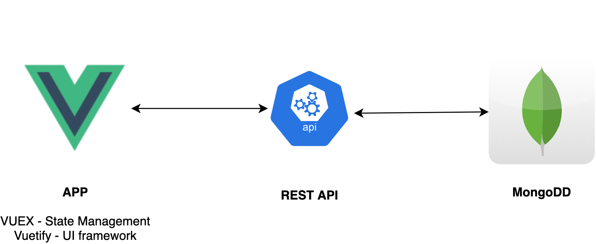

# TodoApp Build Status - [](https://github.com/johnmorrisQADeveloper/013_vue_vuex_mongo_express/actions)





 [](.github/workflows/ubuntuChrome.yml)  [](.github/workflows/zap.yml) 


## Start REST API
```
cd backend
npm i
npm start
```

## Start Vue APP
```
npm run serve
```

## start docker 
```
docker-compose up -d --build
http://localhost:8080/
http://localhost:3000/todos
```

## stop docker
```
docker-compose stop
```

## general docker
```
docker images
docker system prune
docker system prune -a

```

## cypress intellisense
```
/// <reference types="Cypress" />
```

## update dependecies
```
npx npm-check-updates -u
npm update
```
